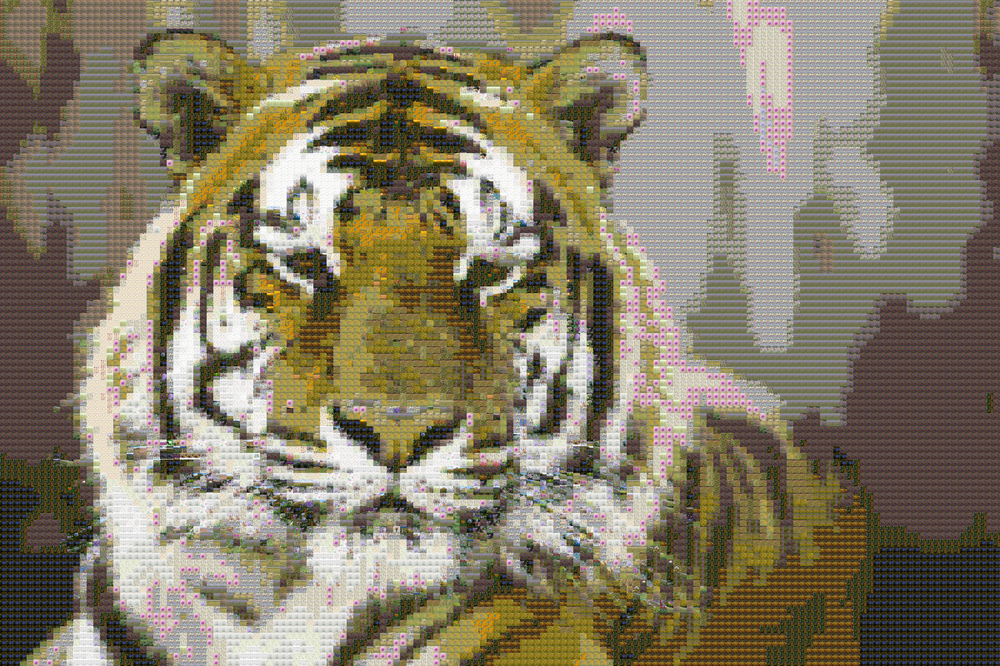

# PhotoMosaic
Create beautiful photo mosaics from your own images.

## Installation

    $ gem install photo_mosaic

## Usage

    $ photo_mosaic --original images/original.jpg --tiles images/tiles --output mosaic.jpg --tile-width 20 --tile-height 20

## Development

After checking out the repo, run `bin/setup` to install dependencies. Then, run `rake spec` to run the tests. You can also run `bin/console` for an interactive prompt that will allow you to experiment.

To install this gem onto your local machine, run `bundle exec rake install`. 

## Contributing

Bug reports and pull requests are welcome on GitHub at https://github.com/axel/photo_mosaic. This project is intended to be a safe, welcoming space for collaboration, and contributors are expected to adhere to the [code of conduct](https://github.com/[USERNAME]/photo_mosaic/blob/master/CODE_OF_CONDUCT.md).

## License

The gem is available as open source under the terms of the [MIT License](https://opensource.org/licenses/MIT).

## Code of Conduct

Everyone interacting in the PhotoMosaic project's codebases, issue trackers, chat rooms and mailing lists is expected to follow the [code of conduct](https://github.com/[USERNAME]/photo_mosaic/blob/master/CODE_OF_CONDUCT.md).
